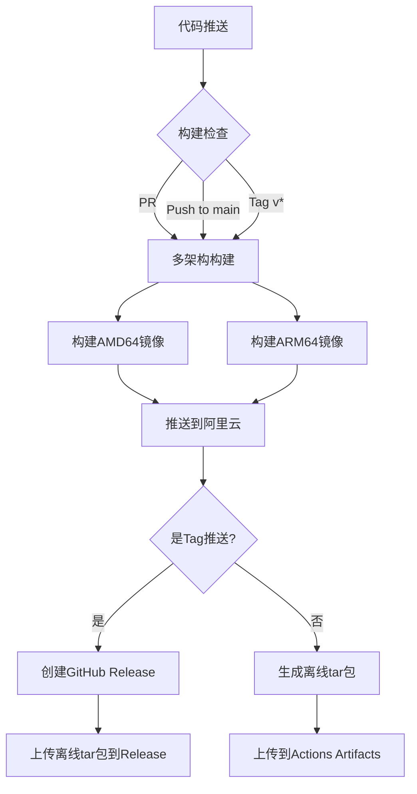

# 🖨️ 远程打印服务

一个基于Web的远程打印托管服务，支持文件上传、预览和打印。

## 📋 目录

- [功能特性](#-功能特性)
- [系统架构](#-系统架构)
- [前置要求](#-前置要求)
- [安装部署](#-安装部署)
- [使用方法](#-使用方法)
- [API接口](#-api接口)
- [故障排除](#-故障排除)

## ✨ 功能特性

- 🌐 **Web界面**: 现代化的响应式Web界面
- 📁 **多格式支持**: PDF, Word, Excel, PPT, 图片, 文本等
- 👁️ **文件预览**: 自动生成文件预览图
- 🖨️ **远程打印**: 通过CUPS集成实现远程打印
- 📋 **任务管理**: 查看和管理打印队列
- 🔄 **状态监控**: 实时显示打印机状态
- 🐳 **Docker部署**: 容器化部署，开箱即用

## 🏗️ 系统架构

```
┌─────────────────────────────────────────────────────────────┐
│                      前端 (HTML/CSS/JS)                      │
│                  http://your-server:5000                    │
└─────────────────────────────────────────────────────────────┘
                              │
                              ▼
┌─────────────────────────────────────────────────────────────┐
│              Flask 后端 (Python 3.11)                         │
│                    :5000                                      │
│  ┌─────────────┐  ┌─────────────┐  ┌─────────────────────┐   │
│  │ 文件上传     │  │ 预览生成     │  │ 打印任务管理        │   │
│  └─────────────┘  └─────────────┘  └─────────────────────┘   │
└─────────────────────────────────────────────────────────────┘
                              │
                              ▼
┌─────────────────────────────────────────────────────────────┐
│                    CUPS 打印服务                             │
│                     :631                                      │
│         ┌──────────────────────────────┐                      │
│         │     HP_DeskJet_4900         │                      │
│         │     物理打印机               │                      │
│         └──────────────────────────────┘                      │
└─────────────────────────────────────────────────────────────┘
```

## 📦 前置要求

### Debian 服务器要求

- **操作系统**: Debian 10 (Buster) 或更高版本
- **内存**: 至少 1GB RAM
- **存储**: 至少 5GB 可用空间
- **网络**: 与打印机在同一局域网

### 打印机要求

- HP DeskJet 4900 系列打印机
- 已通过CUPS配置并可用

### Docker环境（推荐）

- Docker Engine 20.10+
- Docker Compose 2.0+

## 🚀 安装部署

### 方式一：Docker部署（推荐）

```bash
# 1. 克隆或下载项目
git clone <repository-url>
cd printer_server

# 2. 配置环境变量（可选）
cp .env.example .env
# 编辑 .env 文件，修改必要的配置

# 3. 构建并启动服务
docker-compose up -d --build

# 4. 查看日志
docker-compose logs -f print-service

# 5. 检查服务状态
docker-compose ps
```

### 方式二：原生部署

```bash
# 1. 安装系统依赖
sudo apt-get update
sudo apt-get install -y \
    python3-pip \
    python3-venv \
    cups \
    cups-client \
    cups-filters \
    hpijs-ppds \
    hplip \
    ghostscript \
    poppler-utils \
    libmagic1 \
    fonts-dejavu-core \
    fonts-liberation \
    libreoffice

# 2. 创建虚拟环境
python3 -m venv venv
source venv/bin/activate

# 3. 安装Python依赖
pip install -r requirements.txt

# 4. 配置CUPS
sudo systemctl enable cups
sudo systemctl start cups

# 5. 配置打印机（确保HP_DeskJet_4900已配置）
# 访问 http://localhost:631 添加打印机

# 6. 启动服务
python run.py
```

### 方式三：不使用Docker直接连接宿主机CUPS

如果需要在Docker中连接宿主机的CUPS服务：

```bash
# 方式A：使用网络连接
docker run -d \
  --name remote-print \
  -p 5000:5000 \
  -e CUPS_SERVER=your-debian-ip \
  -e CUPS_PORT=631 \
  -v /path/to/uploads:/app/uploads \
  your-image-name

# 方式B：使用Docker卷共享CUPS socket
docker run -d \
  --name remote-print \
  -p 5000:5000 \
  -v /run/cups/cups.sock:/run/cups/cups.sock \
  -e CUPS_SERVER=localhost \
  -e CUPS_PORT=631 \
  -v /path/to/uploads:/app/uploads \
  your-image-name
```

## 📖 使用方法

### 1. 访问Web界面

打开浏览器，访问：`http://<debian-server-ip>:5000`

### 2. 上传文件

- **拖拽上传**: 将文件拖到上传区域
- **点击上传**: 点击上传区域选择文件
- **批量上传**: 支持一次选择多个文件

### 3. 选择打印机

在打印机设置区域选择 `HP_DeskJet_4900`

### 4. 配置打印选项

- **份数**: 设置打印份数 (1-100)
- **页码范围**: 设置打印特定页面 (如 `1-5,8,11-13`)

### 5. 预览和打印

- 点击文件卡片上的 **预览** 按钮查看文件
- 点击 **打印** 按钮提交打印任务

### 6. 管理打印队列

在底部区域查看当前打印任务状态，可取消待处理的任务

## 🔌 API接口

### 健康检查

```bash
GET /api/health
```

响应:
```json
{
  "status": "ok",
  "service": "Remote Print Service",
  "timestamp": "2024-01-01T12:00:00",
  "printer": "HP_DeskJet_4900"
}
```

### 获取打印机列表

```bash
GET /api/printers
```

### 获取打印机状态

```bash
GET /api/printer/status?printer=HP_DeskJet_4900
```

### 上传文件

```bash
POST /api/upload
Content-Type: multipart/form-data

Body: file=@document.pdf
```

### 列出文件

```bash
GET /api/files
```

### 删除文件

```bash
DELETE /api/files/filename.pdf
```

### 打印文件

```bash
POST /api/print
Content-Type: application/json

{
  "filename": "document.pdf",
  "printer": "HP_DeskJet_4900",
  "copies": 1,
  "page_range": "1-5"
}
```

### 获取打印任务

```bash
GET /api/jobs
```

### 取消打印任务

```bash
POST /api/jobs/{job_id}/cancel
```

### 转换文件为PDF

```bash
POST /api/convert
Content-Type: application/json

{
  "filename": "document.docx"
}
```

## ⚙️ 配置说明

### 环境变量

| 变量名 | 默认值 | 说明 |
|--------|--------|------|
| `SERVICE_HOST` | `0.0.0.0` | 服务监听地址 |
| `SERVICE_PORT` | `5000` | 服务端口 |
| `CUPS_SERVER` | `localhost` | CUPS服务器地址 |
| `CUPS_PORT` | `631` | CUPS端口 |
| `CUPS_PRINTER_NAME` | `HP_DeskJet_4900` | 默认打印机名称 |
| `UPLOAD_FOLDER` | `/app/uploads` | 上传文件目录 |
| `MAX_CONTENT_LENGTH` | `52428800` | 最大上传大小(50MB) |
| `DEBUG_MODE` | `false` | 调试模式 |
| `TZ` | `UTC` | 时区设置 |

### CUPS打印机配置

如果需要在容器中使用本地打印机，需要先在Debian上配置CUPS：

```bash
# 1. 安装CUPS
sudo apt install cups

# 2. 启动CUPS服务
sudo systemctl enable cups
sudo systemctl start cups

# 3. 访问CUPS管理界面
# 打开浏览器访问 http://localhost:631

# 4. 添加打印机
# - 点击 "Administration"
# - 点击 "Add Printer"
# - 选择你的打印机 (HP_DeskJet_4900)
# - 选择驱动程序
# - 设置默认选项

# 5. 设置打印机共享（如果需要）
# - 在打印机设置中勾选 "Share This Printer"
```

## 🔧 故障排除

### 常见问题

#### 1. 打印机无法连接

```bash
# 检查CUPS服务状态
sudo systemctl status cups

# 检查打印机是否在线
lpstat -v

# 检查打印机状态
lpstat -s
```

#### 2. Docker权限问题

```bash
# 将用户添加到docker组
sudo usermod -aG docker $USER

# 或者使用特权模式运行
docker run --privileged ...
```

#### 3. USB设备权限

```bash
# 检查USB设备
lsusb

# 添加USB设备权限规则
sudo nano /etc/udev/rules.d/99-usb-printer.rules

# 添加以下内容（替换VendorID和ProductID）
# SUBSYSTEM=="usb", ATTR{idVendor}=="03f0", ATTR{idProduct}=="7d04", MODE="0666"

# 重新加载规则
sudo udevadm control --reload-rules
sudo udevadm trigger
```

#### 4. 文件预览不工作

确保已安装预览依赖：

```bash
# PDF预览需要
sudo apt install poppler-utils

# 图片预览需要（通常已安装）
sudo apt install libjpeg-dev
```

#### 5. Office文档转换

对于Office文档，需要安装LibreOffice：

```bash
sudo apt install libreoffice-writer libreoffice-calc libreoffice-impress
```

### 查看日志

```bash
# Docker日志
docker-compose logs -f

# 应用日志（在容器内）
docker exec -it remote-print-service cat /app/logs/app.log
```

### 重启服务

```bash
# Docker
docker-compose restart

# 原生部署
# 重启应用进程
pkill -f "python run.py"
python run.py &
```

## 📄 支持的文件格式

| 类型 | 扩展名 | 预览 | 打印 |
|------|--------|------|------|
| PDF | .pdf | ✅ | ✅ |
| Word | .doc, .docx | ✅ | ✅ |
| Excel | .xls, .xlsx | ✅ | ✅ |
| PowerPoint | .ppt, .pptx | ✅ | ✅ |
| 文本 | .txt | ✅ | ✅ |
| 图片 | .png, .jpg, .jpeg, .gif, .bmp | ✅ | ✅ |
| HTML | .html, .htm | ✅ | ✅ |
| CSV | .csv | ✅ | ✅ |

## 🔒 安全建议

1. **网络隔离**: 仅在可信网络中使用
2. **访问控制**: 如需公开访问，添加认证
3. **文件清理**: 定期清理上传的文件
4. **日志监控**: 启用日志记录并定期检查

## 📝 许可证

MIT License

## 🤝 贡献

欢迎提交Issue和Pull Request！

## 🔧 ARM64 架构支持

本项目完全支持 ARM64 (aarch64) 架构，专为树莓派、ARM服务器等设备优化。

### 支持的架构

| 架构 | 标识 | 说明 |
|------|------|------|
| AMD64 | `linux/amd64` | 标准x86_64服务器/PC |
| ARM64 | `linux/arm64` | 树莓派4/5, ARM服务器, NAS等 |
| ARMv7 | `linux/arm/v7` | 树莓派3及更早版本（需调整镜像） |

### 获取 ARM64 镜像

#### 方式一：从阿里云镜像仓库拉取

```bash
# 登录阿里云镜像仓库
docker login registry.cn-hangzhou.aliyuncs.com -u 命名空间@云账号ID -p 密码

# 拉取ARM64镜像
docker pull registry.cn-hangzhou.aliyuncs.com/命名空间/remote-print-service:latest

# 运行容器
docker run -d \
  --name remote-print \
  -p 5000:5000 \
  -p 631:631 \
  registry.cn-hangzhou.aliyuncs.com/命名空间/remote-print-service:latest
```

#### 方式二：使用离线 tar 包（推荐用于离线环境）

详细步骤请参考 [离线部署文档](docs/OFFLINE_DEPLOYMENT.md)。

```bash
# 传输并加载离线镜像
scp print-service-arm64.tar user@debian-arm64:/path/
docker load < print-service-arm64.tar

# 运行容器
docker run -d \
  --name remote-print \
  -p 5000:5000 \
  -p 631:631 \
  -v /opt/print-service/uploads:/app/uploads \
  print-service:latest
```

---

## 🤖 CI/CD 自动化构建

本项目使用 GitHub Actions 实现自动化构建和部署。

### 自动化流程



### 自动触发条件

| 事件 | 触发的操作 |
|------|-----------|
| 推送到 `main`/`master` 分支 | 构建镜像 + 推送到阿里云 + 生成离线tar |
| 创建 `v*` 版本标签 | 构建镜像 + 推送到阿里云 + 生成离线tar + 创建Release |
| Pull Request | 仅构建镜像（不推送） |

### 配置阿里云镜像仓库

详细配置请参考 [阿里云镜像服务配置文档](docs/ALIYUN_REGISTRY.md)。

需要在 GitHub 仓库中添加以下 Secrets：

| Secret Name | 说明 |
|-------------|------|
| `ALIYUN_REGISTRY_USERNAME` | 阿里云镜像仓库用户名 |
| `ALIYUN_REGISTRY_PASSWORD` | 阿里云镜像仓库密码 |
| `ALIYUN_REPOSITORY_NAME` | 镜像仓库名称 |

### 手动触发构建

1. 进入 GitHub 仓库的 **Actions** 页面
2. 选择 **Build and Push Docker Image** 工作流
3. 点击 **Run workflow**
4. 选择分支并运行

### 查看构建状态

- **GitHub Actions**: https://github.com/你的用户名/printer_server/actions
- **阿里云镜像仓库**: https://cr.console.aliyun.com

---

## 📞 支持

如有问题，请：
1. 查看[故障排除](#-故障排除)部分
2. 查看项目Issue
3. 提交新的Issue描述问题
